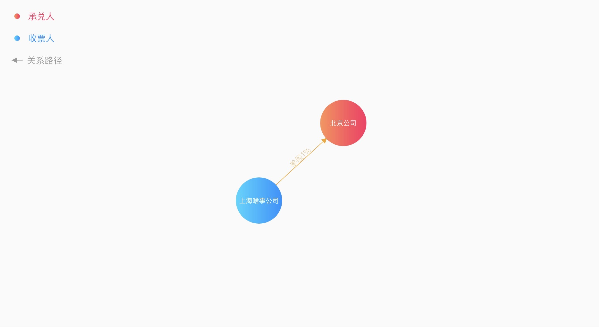
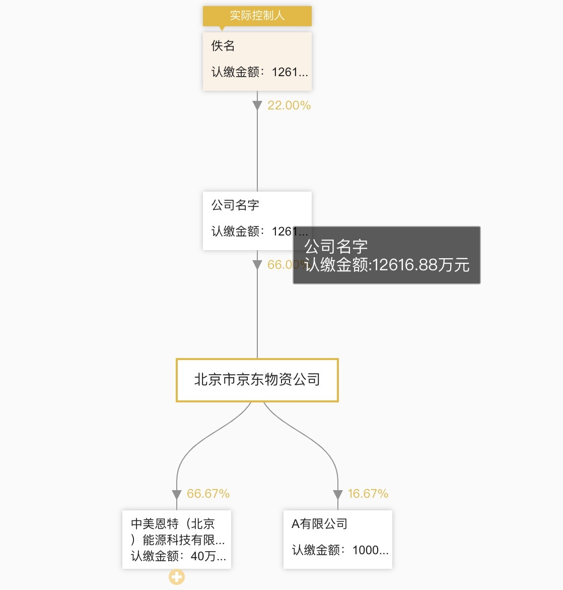

# graph_d3

这个项目是我学习 D3.js 和 canvas 过程中练习的 demo，目录是目前完成的 demo，接下来会不断更新。这里放上我的[博客链接](https://liuyanqing.github.io/)，接下来考虑在博客上总结记录自己的学习过程，一起学习进步 😊

## 目录

1. 关系图
   
2. 树状图（样式和数据结构参照天眼查）
   

## Start Setup

    # install globally
    npm install -g @vue/cli-service-global

    # install dependencies
    npm install

    # serve with hot reload at localhost
    npm start
